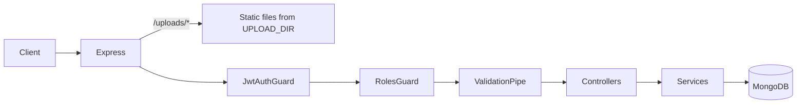
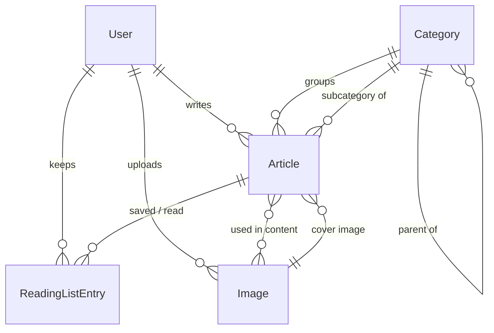

# PROJECT_CONTEXT.md — What exists in `epoch-back`

**Read this file before every task, together with `AGENTS.md`.**
`AGENTS.md` explains *how* to work (rules and conventions). This file explains *what has
been built*: every endpoint, data model, business rule, and design decision. If your task
changes any behaviour described here, update this file in the same change (including the
change history at the bottom).

---

## 1. What the product is

A backend for a website where **moderators and admins write articles** about different
topics, and the public reads them.

- **Users** register themselves and get the `user` role. Besides reading public content,
  every logged-in user can keep a personal **saved (read later)** list and a **read**
  list of published articles.
- **Moderators** write articles (draft, then publish), upload images, and manage only
  their own articles and images.
- **Admins** do everything moderators do, can edit or delete anyone's articles and
  images, manage categories, and change users' roles.
- One admin account is created automatically at startup from environment variables.
- The frontend uses the **Quill** rich-text editor, so article content arrives as HTML.

---

## 2. Architecture overview



### Modules and their dependencies

| Module | Folder | Depends on | Exports |
| --- | --- | --- | --- |
| `AppModule` | `src/app.module.ts` | everything below | — |
| `UsersModule` | `src/users/` | Mongoose `User` model | `UsersService` |
| `AuthModule` | `src/auth/` | `UsersModule`, `JwtModule` (global) | — |
| `CategoriesModule` | `src/categories/` | Mongoose `Category` model | `CategoriesService` |
| `ImagesModule` | `src/images/` | Mongoose `Image` model, `MulterModule` | `ImagesService` |
| `ArticlesModule` | `src/articles/` | `CategoriesModule`, `ImagesModule`, `UsersModule` | `ArticlesService` |
| `ReadingListModule` | `src/reading-list/` | `ArticlesModule`, Mongoose `ReadingListEntry` model | — |

Dependencies only flow one way. `CategoriesService` and `ImagesService` need to know
whether articles still use a category or image. They don't import articles; instead,
`ArticlesService` implements `CategoryUsageChecker` and `ImageUsageChecker` and
registers itself in `onModuleInit()` via `registerUsageChecker()`. If no checker is
registered (e.g. a misconfigured test), those services throw
`Error('... has not been registered')` instead of silently allowing deletes.

The opposite direction works the same way. Modules that reference articles implement
`ArticleDeletionListener` (`src/articles/interfaces/`) and call
`ArticlesService.registerDeletionListener()` in `onModuleInit()`. After an article is
deleted, `ArticlesService.remove()` awaits `onArticleDeleted(id)` on every listener.
Listeners are optional; `ReadingListService` is currently the only one.

### Bootstrap (`src/main.ts`, `src/app.setup.ts`)

- The app is created as a `NestExpressApplication`.
- `configureApp(app)` (also used by the e2e test):
  - `enableCors()`: all origins allowed (no restriction yet).
  - JSON body limit **2 MB** (`useBodyParser('json', { limit: '2mb' })`), needed for
    long article HTML.
  - Global `ValidationPipe` with `whitelist`, `forbidNonWhitelisted`, `transform`.
    Unknown fields return 400 `property X should not exist`.
  - Static files: `UPLOAD_DIR` is served at `/uploads/` with `index: false`,
    `dotfiles: 'deny'`, `maxAge: 30d`, and header `X-Content-Type-Options: nosniff`.
    Static files bypass the guards, so they are **public by URL**.
- `setupSwagger(app)`: Swagger UI at `/docs`, OpenAPI JSON at `/docs-json`, Bearer auth
  scheme registered, `persistAuthorization: true` (the token survives page reloads).
- Listens on `PORT`.

### Global guards (registered in `AppModule`, order matters)

1. **`JwtAuthGuard`** (`src/common/guards/jwt-auth.guard.ts`)
   - Skips routes marked `@Public()`.
   - Otherwise requires `Authorization: Bearer <token>`:
     - no or malformed header → `401 Missing access token`
     - bad signature or expired → `401 Invalid or expired access token`
   - On success sets `request.user = { sub, username, email }` (the JWT payload).
   - It does **not** check that the user still exists; only `RolesGuard` and
     `/auth/me` do.
2. **`RolesGuard`** (`src/common/guards/roles.guard.ts`)
   - Does nothing unless the route or controller has `@Roles(...)`.
   - Loads the user from MongoDB by `request.user.sub`:
     - user missing → `401 User no longer exists`
     - role not listed → `403 Insufficient permissions`
   - On success copies the **database** role into `request.user.role`. Role changes
     therefore apply immediately, without logging in again.

### Shared building blocks (`src/common/`)

| File | Purpose |
| --- | --- |
| `decorators/public.decorator.ts` | `@Public()` skips JWT auth |
| `decorators/roles.decorator.ts` | `@Roles(Role.Admin, ...)` means any listed role passes |
| `decorators/current-user.decorator.ts` | `@CurrentUser()` returns `JwtPayload` (`sub`, `username`, `email`, plus `role` on `@Roles` routes) |
| `enums/role.enum.ts` | `Role.User = 'user'`, `Role.Moderator = 'moderator'`, `Role.Admin = 'admin'` |
| `interfaces/jwt-payload.interface.ts` | `JwtPayload`; `role?` is set by `RolesGuard`, never read from the token |
| `security/password.ts` | `hashPassword()` / `verifyPassword()` (bcryptjs, 12 rounds) |
| `security/ownership.ts` | `assertOwnerOrAdmin(actor, ownerId, message?)` throws `403 You can only modify your own content`; `isAdmin(actor)`. Both fail closed when `role` is missing. |
| `dto/pagination-query.dto.ts` | `page` (int ≥ 1, default 1), `limit` (int 1–100, default 20) |
| `dto/object-id-param.dto.ts` | validates `:id` as a Mongo ObjectId; otherwise `400 id must be a mongodb id` |
| `utils/slugify.ts` | `slugify(text)`: NFKC-normalizes, lowercases, turns every run of non-letters/digits (Unicode-aware) into `-`, trims `-`, max 80 chars. `withRandomSuffix(slug)` appends `-` and 6 hex characters. |
| `utils/mongo-errors.ts` | `isDuplicateKeyError(error)` detects Mongo error 11000 |
| `constants/uploads.constants.ts` | `UPLOADS_URL_PREFIX = '/uploads'` |

### Error response format

All errors use Nest's default shape:

```json
{ "statusCode": 409, "message": "Username is already taken", "error": "Conflict" }
```

Validation errors have `message` as an **array** of strings.

---

## 3. Data models (MongoDB collections)

All schemas use `timestamps: true` (`createdAt`, `updatedAt`). References use
`MongooseSchema.Types.ObjectId`. `Types.ObjectId` is stored as a plain string in
Mongoose 9; that was a real bug here, fixed on 2026-10-01.

### `users` (`src/users/schemas/user.schema.ts`)

| Field | Type | Rules |
| --- | --- | --- |
| `username` | string | required, **unique**, lowercased, trimmed |
| `email` | string | required, **unique**, lowercased, trimmed |
| `password` | string | bcrypt hash, required, `select: false` (never returned) |
| `role` | `'user' \| 'moderator' \| 'admin'` | default `user`, indexed |

### `categories` (`src/categories/schemas/category.schema.ts`)

| Field | Type | Rules |
| --- | --- | --- |
| `name` | string | required, **unique**, trimmed |
| `slug` | string | required, **unique**, generated from `name` |
| `description` | string? | trimmed |
| `parent` | ObjectId → Category \| null | default `null`, indexed. Set for **subcategories**, `null` for top-level categories. Only one level: a parent must itself be top-level. Fixed at creation. |

Names and slugs are unique across **all** categories and subcategories (the original
unique indexes were kept), so two parents can't both have a subcategory called
"Medieval". Documents created before subcategories existed have no `parent` field;
`{ parent: null }` matches them too, so they are top-level without any migration.

### `images` (`src/images/schemas/image.schema.ts`)

| Field | Type | Rules |
| --- | --- | --- |
| `filename` | string | **unique**, `<uuid>.<jpg\|png\|webp\|gif>` on disk in `UPLOAD_DIR` |
| `mimeType` | string | detected from file bytes, not trusted from the client |
| `size` | number | bytes |
| `alt` | string? | alternative text |
| `uploadedBy` | ObjectId → User | required, indexed |

The public URL isn't stored. It is computed as `PUBLIC_BASE_URL + '/uploads/' + filename`.

### `articles` (`src/articles/schemas/article.schema.ts`)

| Field | Type | Rules |
| --- | --- | --- |
| `title` | string | required, trimmed |
| `slug` | string | required, **unique** |
| `content` | string | **sanitized** HTML |
| `plainText` | string | text-only copy of `content` for search, `select: false` |
| `excerpt` | string | plain-text summary, up to ~200 characters |
| `coverImage` | ObjectId → Image | required, indexed |
| `contentImages` | ObjectId[] → Image | images referenced inside `content`, recomputed whenever content changes, indexed |
| `category` | ObjectId → Category | required, indexed; always a **top-level** category |
| `subcategory` | ObjectId → Category \| null | optional, default `null`, indexed; must be a subcategory whose `parent` is `category`. Missing on articles created before 2026-10-05, which means "no subcategory". |
| `tags` | string[] | lowercased, deduplicated, indexed |
| `author` | ObjectId → User | required, indexed |
| `status` | `'draft' \| 'published'` | default `draft` |
| `publishedAt` | Date \| null | set on the **first** publish only |

Extra indexes: `{ status: 1, publishedAt: -1 }`, plus a text index on
`{ title (weight 5), plainText (weight 1) }` with `default_language: 'none'` (no English
stemming, so Georgian text is handled correctly).

### `readinglistentries` (`src/reading-list/schemas/reading-list-entry.schema.ts`)

| Field | Type | Rules |
| --- | --- | --- |
| `user` | ObjectId → User | required |
| `article` | ObjectId → Article | required, indexed (for cleanup on article delete) |
| `list` | `'saved' \| 'read'` | required |

Indexes: **unique** `{ user, list, article }` (an article appears at most once per list)
and `{ user, list, createdAt: -1 }` for listing. `createdAt` is returned as `addedAt`.



---

## 4. Endpoints in detail

Legend for **Auth**: *Public* (no token); *Bearer* (any logged-in user); *Mod/Admin*
(role moderator or admin); *Admin*; *Owner/Admin* (moderator who owns the resource, or
any admin). Every non-public endpoint can also return `401` (see the guards above), and
every role-restricted one `403 Insufficient permissions`. Every `:id` param must be a
valid ObjectId, otherwise `400`.

### 4.1 Health

| Method | Path | Auth | Response |
| --- | --- | --- | --- |
| GET | `/` | Public | `200` text `Hello World!` |

### 4.2 Auth (`src/auth/`)

**Shared response `AuthResponseDto`:**

```json
{
  "accessToken": "eyJ...",
  "tokenType": "Bearer",
  "expiresIn": 86400,
  "user": { "id": "...", "username": "john_doe", "email": "john@example.com", "role": "user", "createdAt": "...", "updatedAt": "..." }
}
```

The JWT payload is `{ sub: userId, username, email }`. It is signed with `JWT_SECRET`
and expires after `JWT_EXPIRES_IN` seconds. There are no refresh tokens and no logout or
revocation; a token stays valid until it expires.

#### `POST /auth/register` (Public, 201)

Body:

| Field | Rules |
| --- | --- |
| `username` | trimmed and lowercased first; 3–30 chars; only `a-z 0-9 _ .` |
| `email` | trimmed and lowercased; valid email; max 254 |
| `password` | 8–72 chars; at least one letter and one digit |

Behaviour: checks username and email conflicts first, hashes the password, creates the
user with role `user` (sending a `role` field returns 400), and returns an auth response.

Errors:
- `400` validation
- `409 Username is already taken`, `409 Email is already registered`,
  `409 Username and email are already taken`
- A concurrent duplicate that slips past the pre-check is still mapped to the same 409
  through the unique index.

#### `POST /auth/login` (Public, 200)

Body: `identifier` (username **or** email; trimmed and lowercased; max 254) and
`password` (non-empty, max 72).

If `identifier` contains `@` the lookup is by email, otherwise by username. Login is
effectively case-insensitive. Unknown user and wrong password both return
`401 Invalid credentials`, so the API doesn't reveal which accounts exist.

#### `GET /auth/me` (Bearer, 200)

Returns `UserResponseDto` for the token's user. Returns `401 User no longer exists` if
the account was deleted.

### 4.3 Users (`src/users/`): all Admin

#### `GET /users` (200)

Query: `page`, `limit`, optional `role` (`user|moderator|admin`). Sorted newest first.
Response: `{ items: UserResponseDto[], total, page, limit }`.

#### `PATCH /users/:id/role` (200)

Body: `{ "role": "user" | "moderator" | "admin" }`. Use `"user"` to revoke rights.
Returns the updated `UserResponseDto`.

Errors:
- `400` invalid role or id
- `403 You cannot change your own role` (prevents an admin locking themselves out)
- `404 User not found`

#### Admin seeding (`src/users/admin-seeder.service.ts`)

On every application start (`onApplicationBootstrap`), the app reads `ADMIN_USERNAME`,
`ADMIN_EMAIL` and `ADMIN_PASSWORD`, trimming and lowercasing the username and email.

- If a user with that username **or** email exists, it is promoted to `admin` if needed.
  Its password is **never** overwritten.
- Otherwise the user is created as `admin` with the hashed password.

The current admin is `Master_Elodin`, stored as `master_elodin`, with email
`mikheil.kvashali1204@gmail.com`. The password is in `.env` only.

### 4.4 Categories (`src/categories/`)

Categories have **optional subcategories**, one level deep. A subcategory is a category
document with `parent` set; it uses the same endpoints.

**`CategoryResponseDto`:**
`{ id, name, slug, description?, parent, articleCount, createdAt, updatedAt, subcategories }`
- `parent`: `{ id, name, slug }` for a subcategory, `null` for a top-level category.
- `subcategories`: the subcategories (same fields, without `subcategories`), sorted by
  name; always `[]` for a subcategory and for categories that have none.
- `articleCount` counts **published** articles only. A top-level category counts every
  article whose `category` is it, which **includes** the articles in its subcategories.
  A subcategory counts the articles whose `subcategory` is it.

| Method | Path | Auth | Success |
| --- | --- | --- | --- |
| GET | `/categories` | Public | `200` array of **top-level** categories sorted by name, each with `subcategories` nested (subcategories are not repeated at the top level) |
| GET | `/categories/:slug` | Public | `200` category or subcategory; `404 Category not found` |
| POST | `/categories` | Admin | `201` |
| PATCH | `/categories/:id` | Admin | `200` |
| DELETE | `/categories/:id` | Admin | `204` |

Create and update body:
- `name`: trimmed, 2–50 characters; required on create, optional on update
- `description`: trimmed, max 500, optional
- `parentId`: **create only**, optional ObjectId of a top-level category; creates a
  subcategory. `400 Parent category does not exist`;
  `400 Subcategories cannot have their own subcategories` if the parent is a
  subcategory. Sending `parentId` to PATCH returns `400 property parentId should not exist`:
  the parent can't change, so articles can never end up with a subcategory of another
  category. To move a subcategory, create a new one and reassign the articles.

Rules:
- `slug = slugify(name)`. If that's empty (no letters or digits), the request fails with
  `400 Category name must contain letters or numbers`.
- A name or slug collision returns `409 A category with this name already exists`.
  This also catches names that differ only in case or punctuation.
- **Renaming regenerates the slug**, so the category URL changes. Updating only
  `description` keeps it.
- Delete returns `409 Category has N subcategory(ies); delete them first` if it has
  subcategories, `409 Category is used by N article(s); move or delete them first` if any
  article, draft or published, references it as `category` or `subcategory`, and `404` if
  it doesn't exist.

### 4.5 Images (`src/images/`): all Mod/Admin

**`ImageResponseDto`:**
`{ id, url, alt?, filename, mimeType, size, uploadedBy (user id), createdAt }`, where
`url` is absolute, e.g. `http://localhost:3000/uploads/<uuid>.png`.
**`ImageSummaryDto`** (embedded in articles): `{ id, url, alt? }`.

#### `POST /images` (201): multipart/form-data

Fields: `file` (required) and `alt` (optional, trimmed, max 200).

Pipeline:
1. Multer keeps the file **in memory**. Size limit is `MAX_UPLOAD_SIZE_MB` and one file
   per request; larger files return `413 File too large`.
2. `ParseFilePipe` + `FileTypeValidator` check the actual **bytes** (magic numbers via
   `file-type`) against jpeg, png, webp and gif, then overwrite `mimetype` with the
   detected type.
   - missing file → `400`
   - wrong content, e.g. a text file renamed to `.png` → `400 Validation failed (current file type is ...)`
3. The service writes the file as `<randomUUID>.<ext>` and creates the record. If the
   database insert fails, the file is deleted again.

#### Other image endpoints

| Method | Path | Auth | Behaviour |
| --- | --- | --- | --- |
| GET | `/images` | Mod/Admin | `page`, `limit`; newest first; **moderators see only their own, admins see all**; `{ items, total, page, limit }` |
| GET | `/images/:id` | Mod/Admin | any image's details; `404 Image not found` |
| PATCH | `/images/:id` | Owner/Admin | body `{ alt }` (required string, max 200; `""` clears it) |
| DELETE | `/images/:id` | Owner/Admin | `204`; deletes the record and the file on disk |

Delete returns `409 Image is used by an article; remove it from the article first` if
any article uses the image as `coverImage` or inside its content (`contentImages`).
Non-owner moderators get `403 You can only modify your own content`.

### 4.6 Articles (`src/articles/`)

**`ArticleSummaryDto`** (used in lists, no `content`):

```json
{
  "id": "...", "title": "...", "slug": "...", "excerpt": "...",
  "coverImage": { "id": "...", "url": "...", "alt": "..." },
  "category": { "id": "...", "name": "...", "slug": "..." },
  "subcategory": { "id": "...", "name": "...", "slug": "..." } | null,
  "tags": ["middle ages"],
  "author": { "id": "...", "username": "master_elodin" },
  "status": "draft" | "published",
  "publishedAt": "..." | null,
  "createdAt": "...", "updatedAt": "..."
}
```

**`ArticleResponseDto`** = summary + `content` (sanitized HTML, safe to render directly).
`coverImage`, `category` and `author` are `null` if the referenced record is missing;
`subcategory` is `null` when the article has none. They are resolved with one batched
query per type (category and subcategory share one query), not `populate()`.

Paginated lists return `{ items: ArticleSummaryDto[], total, page, limit }`.

Routes are declared so that `/articles/search` and `/articles/manage` are matched before
`/articles/:slug`.

#### Public reading

| Method | Path | Behaviour |
| --- | --- | --- |
| GET | `/articles` | **Published only**, sorted by `publishedAt` newest first. Query: `page`, `limit`, `category` (category or subcategory **slug**), `categoryId` (category or subcategory id; `400` if not an ObjectId; if both `category` and `categoryId` are sent they must match, otherwise the page is empty). A **top-level** category matches all its articles, including those in its subcategories; a **subcategory** matches only articles with that subcategory. Other params: `tag` (lowercased, exact match), `author` (**username**), `q` (full-text search over title and content, whole words, max 100). An unknown category slug/id or author returns an empty page, not an error. |
| GET | `/articles/search` | Search box endpoint. **Published only**, sorted by `publishedAt` newest first, paginated (`page`, `limit`). `q` is required (NFC-normalized, trimmed, 1–100 chars). Matches **parts of words**, case-insensitive, in the `title` or any of the `tags` (`სებას` finds `იოჰან სებასტიან ბახი`). `q` is split on whitespace and **every** word must appear in the title or in a tag (not necessarily the same field). Regex characters are escaped. Content is not searched (use `GET /articles?q=` for whole-word search over content). `400` if `q` is missing, blank or too long. |
| GET | `/articles/:slug` | Published article with `content`; `404 Article not found` for drafts and unknown slugs. Non-Latin slugs must be URL-encoded by the client. |

#### Authoring (Mod/Admin)

| Method | Path | Auth | Behaviour |
| --- | --- | --- | --- |
| GET | `/articles/manage` | Mod/Admin | Drafts and published. Moderators see their own; admins see all. Query: `page`, `limit`, `status`, `categoryId` (category or subcategory id, same matching as the public list; unknown id gives an empty page). Sorted by `updatedAt` newest first. |
| GET | `/articles/manage/:id` | Owner/Admin | Any status, with `content`. `404` / `403`. |
| POST | `/articles` | Mod/Admin | `201`; **always created as `draft`**; the author is the caller. |
| PATCH | `/articles/:id` | Owner/Admin | `200`; partial update of any create field. |
| DELETE | `/articles/:id` | Owner/Admin | `204`. Images are not deleted. |
| POST | `/articles/:id/publish` | Owner/Admin | `200`; `status = published`; `publishedAt` set only if it was null. |
| POST | `/articles/:id/unpublish` | Owner/Admin | `200`; `status = draft`; `publishedAt` kept, so republishing keeps the original date. |

Create body (`CreateArticleDto`; update uses `PartialType` of it):

| Field | Rules |
| --- | --- |
| `title` | trimmed, 3–200 chars |
| `content` | non-empty string, max 1,000,000 chars; Quill HTML |
| `coverImageId` | ObjectId of an existing image, otherwise `400 Cover image does not exist` |
| `categoryId` | ObjectId of an existing **top-level** category, otherwise `400 Category does not exist`, or `400 categoryId must be a top-level category; send the subcategory as subcategoryId` |
| `subcategoryId` | optional ObjectId (or `null`) of a subcategory of `categoryId`. `400 Subcategory does not exist`; `400 Subcategory does not belong to the selected category`. Omitted or `null` on create means no subcategory. On update: omitted keeps it, `null` removes it. When only `categoryId` changes, the kept subcategory must still belong to the new category, otherwise the same 400 (send `subcategoryId: null` or a matching one together with it). |
| `tags` | optional; each trimmed and lowercased; empty ones removed; duplicates removed; max 10; each 1–30 chars |

Slug rules (`generateUniqueSlug`):
- `slugify(title)`, or `article` if that's empty.
- The reserved slugs `manage` and `search` always get a random suffix (e.g.
  `manage-aa5101`). `search` was added on 2026-10-05; an article created earlier with
  the exact slug `search` would be shadowed by the search route.
- If the slug is taken, it retries with a random suffix up to 5 times, then fails with
  `409 Could not generate a unique slug; try a different title`.
- Changing the title **regenerates the slug only while the article has never been
  published**, so public URLs stay stable after the first publish.

Ownership failures return `403 You can only modify your own content`.

#### Content processing (`src/articles/article-content.service.ts`)

Every time `content` is created or changed, `ArticleContentService.process()` runs:

1. **Sanitizes** the HTML with `sanitize-html`, using an allowlist that matches Quill's
   output:
   - Allowed tags: `p br h1–h6 strong b em i u s sub sup blockquote pre code ol ul li a img span`.
     Everything else (`script`, `iframe`, `style`, video embeds, ...) is removed.
   - Allowed attributes:
     - `a`: `href`, `target`, `rel`
     - `img`: `src`, `alt`, `width`, `height`
     - `li`: `data-list`
     - `pre`: `data-language`, `spellcheck`
     - any tag: `class`, `style`
   - `class` keeps only `ql-*` class names.
   - `style` keeps only `color` and `background-color` (hex or rgb/rgba values) and
     `text-align` (left, right, center or justify).
   - URL schemes: `http`, `https`, `mailto`. `javascript:` links lose their `href`.
     Protocol-relative URLs are not allowed.
   - Links with `target="_blank"` get `rel="noopener noreferrer"`.
2. **Images inside content:** an `` is allowed only if its `src` points at our own
   upload: `PUBLIC_BASE_URL/uploads/<uuid>.<ext>` or relative `/uploads/<uuid>.<ext>`.
   Its `src` is rewritten to the absolute URL. Any other image, including **pasted
   base64** (`data:`) or external URLs, returns
   `400 Images in content must be uploaded via POST /images first (...)`.
3. **Plain text:** block tags (`p`, headings, `li`, `blockquote`, `pre`, `br`) become
   spaces, all tags are stripped, HTML entities are decoded and whitespace is collapsed.
   The result is stored in `plainText` for search.
4. **Excerpt:** the first 200 characters of the plain text, cut at a word boundary, with
   `…` appended when truncated.
5. Content with no text and no images returns `400 Article content cannot be empty`.
6. `ArticlesService` maps the image filenames to image ids and stores them in
   `contentImages`. A filename with no image record returns
   `400 Content references images that do not exist: ...`.

### 4.7 Tags

#### `GET /tags` (Public, 200)

Query: `q` (optional prefix, trimmed and lowercased, max 30; regex-escaped) and `limit`
(1–100, default 50). Only **published** articles count. Sorted by count descending, then
name.

Response: `[{ "name": "middle ages", "count": 7 }]`.

### 4.8 Reading list (`src/reading-list/`): all Bearer

Every logged-in user, whatever the role, has two independent personal lists: **saved**
(read later) and **read**. The user is always taken from the token (`@CurrentUser().sub`),
so nobody can see or change another user's lists. `:id` is the **article id**.

| Method | Path | Success | Behaviour |
| --- | --- | --- | --- |
| GET | `/me/saved-articles` | `200` | `page`, `limit`; newest saved first |
| PUT | `/me/saved-articles/:id` | `204` | save a published article |
| DELETE | `/me/saved-articles/:id` | `204` | remove from saved |
| GET | `/me/read-articles` | `200` | `page`, `limit`; most recently marked first |
| PUT | `/me/read-articles/:id` | `204` | mark a published article as read |
| DELETE | `/me/read-articles/:id` | `204` | mark as unread |

List response (`PaginatedReadingListResponseDto`):

```json
{ "items": [{ "article": { "...": "ArticleSummaryDto" }, "addedAt": "..." }], "total": 1, "page": 1, "limit": 20 }
```

Rules:
- `PUT` only accepts **published** articles; drafts and unknown ids return
  `404 Article not found`. A malformed id returns `400 id must be a mongodb id`.
- `PUT` is **idempotent**: adding an article that is already in the list returns `204`
  and keeps the original `addedAt`. Concurrent duplicates are caught by the unique index.
- `DELETE` is idempotent too: removing an article that isn't in the list returns `204`.
- The two lists are independent. Marking an article as read does **not** remove it from
  saved.
- Articles that are unpublished later stay stored but are **hidden** from the lists and
  excluded from `total`. They reappear if the article is republished.
- Deleting an article removes it from every user's lists (`ArticleDeletionListener`).
- Listing loads the user's entry ids (one query), keeps those whose article is published
  (one query), paginates in memory, and then builds summaries for that page only. This
  keeps `total` exact and the order by `addedAt`, but it reads every entry id of the
  list per request (see known gaps).

---

## 5. Permissions matrix

| Action | Public | user | moderator | admin |
| --- | --- | --- | --- | --- |
| Register / log in | yes | — | — | — |
| `GET /auth/me` | — | yes | yes | yes |
| Read categories, published articles, tags | yes | yes | yes | yes |
| Own saved / read lists (`/me/...`) | — | yes | yes | yes |
| Create, update or delete categories | — | — | — | yes |
| Upload images; list own images; view any image | — | — | yes | yes |
| Edit alt text or delete an image | — | — | own | any |
| Create articles | — | — | yes | yes |
| View drafts in manage endpoints | — | — | own | all |
| Edit, delete, publish or unpublish articles | — | — | own | any |
| List users, change roles | — | — | — | yes (not own role) |

---

## 6. Configuration (`src/config/env.validation.ts`)

Validated at startup; the app refuses to start with a list of all problems.
`.env` is git-ignored; `.env.example` has placeholders.

| Variable | Required | Default | Rule |
| --- | --- | --- | --- |
| `PORT` | no | 3000 | positive integer |
| `MONGODB_URI` | yes | — | non-empty |
| `JWT_SECRET` | yes | — | at least 32 characters |
| `JWT_EXPIRES_IN` | no | 86400 | positive integer (seconds); 86400 is one day |
| `ADMIN_USERNAME` | yes | — | 3–30 chars of `a-zA-Z0-9_.` (stored lowercased) |
| `ADMIN_EMAIL` | yes | — | must contain `@` |
| `ADMIN_PASSWORD` | yes | — | 8–72 characters |
| `UPLOAD_DIR` | no | `uploads` | relative to the working directory; created at startup |
| `MAX_UPLOAD_SIZE_MB` | no | 5 | positive number |
| `PUBLIC_BASE_URL` | no | `http://localhost:3000` | http(s) URL; trailing `/` stripped; used for image URLs |

---

## 7. Dependencies added on top of the Nest starter

| Package | Why |
| --- | --- |
| `@nestjs/swagger` | API docs at `/docs` |
| `@nestjs/jwt` | signing and verifying access tokens |
| `class-validator`, `class-transformer` | DTO validation and transformation |
| `bcryptjs` | password hashing (pure JS, no native build) |
| `sanitize-html` (+ `@types/sanitize-html`) | cleaning article HTML |

Multer (uploads) and `file-type` (magic-byte detection) come with
`@nestjs/platform-express` and `@nestjs/common`.

---

## 8. Tests

Run with `npm test`: 11 files, 75 tests, all passing as of 2026-10-05.

| Spec | Covers |
| --- | --- |
| `src/app.controller.spec.ts` | hello endpoint |
| `src/auth/auth.service.spec.ts` | register (hashing, username/email conflicts, duplicate-key race), login (success, wrong password, unknown user) |
| `src/users/users.service.spec.ts` | role update success, cannot change own role, user not found |
| `src/users/admin-seeder.service.spec.ts` | creates admin, promotes an existing user without touching the password, no-op if already admin |
| `src/common/guards/roles.guard.spec.ts` | no `@Roles` passes; matching role passes; wrong role gets 403 |
| `src/common/utils/slugify.spec.ts` | Latin, Georgian, empty, length cap, random suffix |
| `src/categories/categories.service.spec.ts` | create with slug, create subcategory, unknown parent 400, no sub-of-sub 400, list nests subcategories with counts, duplicate 409, delete with subcategories 409, delete in use 409, delete missing 404 |
| `src/images/images.service.spec.ts` | non-owner delete 403, in-use delete 409, admin delete, URL/filename parsing (including path-traversal rejection) |
| `src/articles/article-content.service.spec.ts` | strips scripts/handlers/`javascript:`/iframes, keeps Quill classes and safe styles, `rel=noopener`, image URL rewrite, rejects external/base64 images, plain text and excerpt, empty content |
| `src/articles/articles.service.spec.ts` | draft creation, unknown category, missing content images, non-owner 403, admin edit, slug stability after publish, `publishedAt` set once, unknown category filter, `categoryId` filter (public, slug/id mismatch, unknown id, managed scoped to the moderator), subcategory slug filter, subcategory on create (valid, none, wrong parent, subcategory as `categoryId`), stale subcategory on category change, clearing with `null`, deletion listeners notified, search (partial Georgian match on title/tags, every word required, regex escaping), reserved slug `search` |
| `src/reading-list/reading-list.service.spec.ts` | upsert, unpublished/missing article 404, duplicate-key race treated as success, other errors rethrown, hidden unpublished entries with exact `total` and pagination, cleanup on article delete |

`test/app.e2e-spec.ts` (`npm run test:e2e`) needs a running MongoDB. It hasn't been run
yet. Every feature was also verified manually against the live dev server with a full
scenario of about 65 checks (permissions, sanitization, uploads, filters, deletes,
cleanup).

---

## 9. Notes for the frontend

`docs/ANGULAR_CLIENT_PROMPT.md` is a self-contained prompt for the AI working on the
Angular frontend. It contains every endpoint, the TypeScript interfaces, the services to
generate, and the validation limits. **Whenever an endpoint, field, validation limit or
error message changes, update that file too.**

`docs/ANGULAR_READING_LIST_PROMPT.md` is a standalone prompt for adding the saved/read
lists (section 4.8) to an Angular app that already has the base client. Keep it in sync
with the reading-list endpoints.

`docs/ANGULAR_SUBCATEGORIES_PROMPT.md` is a standalone prompt for updating an existing
Angular app to subcategories: model changes, the admin add/edit category flow, the
add/edit article flow (dependent pickers, PATCH semantics) and display/filtering. Keep it
in sync with the category and article rules.

`docs/ANGULAR_SEARCH_PROMPT.md` is a standalone prompt for adding search to the Angular
app: `ArticlesService.search()`, a debounced header search box with suggestions, a
`/search?q=&page=` results page and client-side match highlighting. Keep it in sync with
`GET /articles/search`.

`docs/ANGULAR_PRODUCTION_PROMPT.md` tells the frontend AI how to point the production
build at the deployed API (`https://api.epoch.ge`, frontend on Vercel at
`https://epoch.ge`). Update it if the production hosts change.

- Send `Authorization: Bearer <accessToken>` on protected calls. Get the role from
  `user.role` in the login/register response or from `/auth/me`.
- **Quill images:** configure a custom image handler that uploads to `POST /images`
  (multipart field `file`) and inserts the returned `url`. Quill's default base64
  embedding is rejected by the API.
- For the cover image, upload it first and send its `id` as `coverImageId`.
- Encode slugs in URLs (`encodeURIComponent`), especially Georgian ones.
- Render `content` directly; it is already sanitized on the server.
- Use `GET /tags?q=...` for tag autocomplete and `GET /categories` for category pickers.
- Pagination is page-based: `page` and `limit` in, `total` out.

---

## 10. Known gaps and possible next steps

Not implemented yet. Ask the user before assuming any of these:

- Refresh tokens, logout or token revocation, password change or reset, email
  verification.
- Rate limiting and brute-force protection on login.
- Deleting users; listing users for moderators.
- CORS is open to all origins.
- Comments, likes, view counts, related articles, RSS feed, sitemap.
- Image resizing/thumbnails; cleanup of orphaned images that no article uses.
- Video embeds in content (iframes are stripped).
- `GET /articles/search` uses unanchored regexes, which can't use an index, so it scans
  all published articles. Fine at the current size; switch to MongoDB Atlas Search
  (n-gram) or a dedicated search engine if the collection grows large. Results are
  ordered by date, not by relevance.
- Scheduled publishing.
- Moving an article between categories is allowed, but there is no bulk move for
  deleting a category that still has articles.
- Subcategories: only one level; a subcategory can't be moved to another parent or
  turned into a top-level category; subcategory names must be unique across all
  categories (two parents can't share a subcategory name).
- Reading list: no endpoint to check whether one specific article is saved/read (the
  client must load the lists), no size cap per list, and listing reads every entry id of
  the list per request, which is fine for personal lists but not for huge ones. Read
  state is set explicitly by the client; nothing is marked read automatically.

---

## 11. Current data state (development)

The local database `epoch` contains only the seeded admin user. All test users,
categories, images and articles created during verification were deleted, and
`uploads/` is empty.

---

## 12. Change history

| Date | Change |
| --- | --- |
| 2026-10-01 | Created `AGENTS.md` (agent rules) and the `.cursor/rules/read-agents-md.mdc` always-applied rule. |
| 2026-10-01 | Registration and login (username or email + password, JWT), global JWT guard with `@Public()`, global validation, Swagger at `/docs`, env validation. |
| 2026-10-01 | Roles (`user`, `moderator`, `admin`), `RolesGuard` reading roles from the database, admin seeding from env, `GET /users`, `PATCH /users/:id/role`. |
| 2026-10-01 | Categories, images (local uploads) and articles (draft/publish, sanitized Quill HTML, slugs, excerpt, search, filters, tags endpoint), ownership checks, safe deletes, shared pagination/id DTOs. Fixed ObjectId references being stored as strings. |
| 2026-10-01 | Created this file (`PROJECT_CONTEXT.md`). |
| 2026-10-01 | Added `docs/ANGULAR_CLIENT_PROMPT.md` (prompt for generating the Angular API client). |
| 2026-10-03 | `categoryId` query filter on `GET /articles` and `GET /articles/manage`. |
| 2026-10-04 | Deployed to Railway at `https://api.epoch.ge`. Added `docs/ANGULAR_PRODUCTION_PROMPT.md` (prompt for pointing the Angular production build at the deployed API). |
| 2026-10-04 | Reading list for logged-in users: `/me/saved-articles` and `/me/read-articles` (GET list, PUT add, DELETE remove), new `readinglistentries` collection, `ArticleDeletionListener` so deleting an article cleans up the lists. `ArticlesModule` now exports `ArticlesService`. |
| 2026-10-04 | Added `docs/ANGULAR_READING_LIST_PROMPT.md` (frontend prompt for the reading-list feature). |
| 2026-10-05 | Subcategories: optional `parent` on categories (one level, fixed at creation), optional `subcategory` on articles (`subcategoryId` in create/update, must belong to `categoryId`), `GET /categories` returns top-level categories with `subcategories` nested, `parent`/`subcategory` added to responses, category filters accept subcategories, delete blocked while subcategories exist. Backward compatible: no migration, existing documents read as top-level / no subcategory; new indexes `categories.parent_1` and `articles.subcategory_1` are built on startup. |
| 2026-10-05 | Added `docs/ANGULAR_SUBCATEGORIES_PROMPT.md` (frontend prompt for the subcategory changes). |
| 2026-10-05 | `GET /articles/search`: public, paginated partial (substring), case-insensitive search over published article titles and tags; every word of `q` must match. `search` added to the reserved article slugs. No schema changes. |
| 2026-10-05 | Added `docs/ANGULAR_SEARCH_PROMPT.md` (frontend prompt for the search feature). |
| 2026-10-06 | Access tokens last one day: `JWT_EXPIRES_IN` default is `86400` seconds (was `3600`). Existing tokens keep the expiry they were issued with. |
